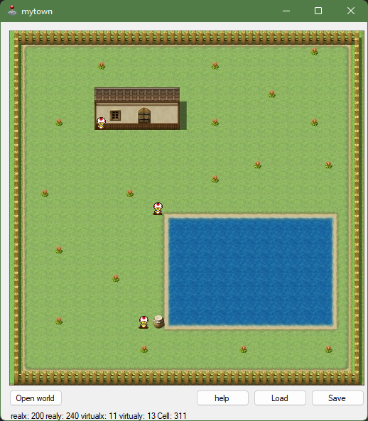

# Legacy VB CellGame

This was one of my earliest attempts at making a game, utilizing WinForms of all things

I was mostly inspired by old, limited 2D RPGs like Pokemon or Harry Potter for the GameBoy Color

## Download
Experience the jank for yourself:

[Click to download](https://github.com/andrewiankidd/legacy-vb-cellgame/releases/download/release/Debug.zip)

## Running
- With the form open, click 'Open world'
- go into 'worlds' folder
- select 'World 1.world'

## Video

Click to play

